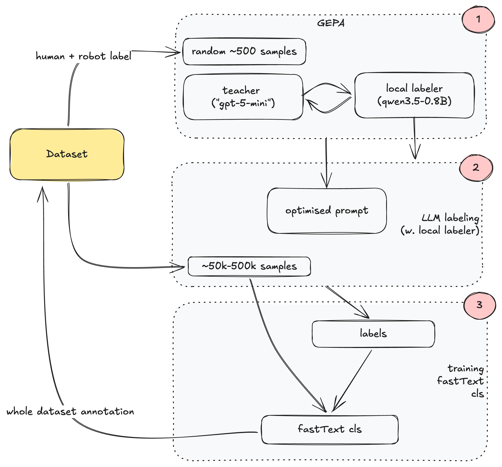

# IDEA.md

Reach goal faster by curating/ordering the existing FineWeb data into an easy→hard curriculum — *not* by rewriting or heavily removing it, since the val set is drawn from the same distribution, so cutting "noise" the test data also contains would only drift us off-target and slow convergence.


## Plan

Currate the FineWeb training data with a cheap, distilled teacher to drive transforms that reorder and filter the dataset. We distill an expensive judgment into something cheap enough to run over 5B tokens, in three hops:



### Parts
- **Teacher.** Strong model like "gpt-5-mini" (or similar) provides high-quality reference labels (human verified) + the reflective feedback.
- **GEPA optimization.** [DSPy GEPA](https://dspy.ai/api/optimizers/GEPA/overview/) evolves the prompt of the small [`Qwen3.5-0.8B`](https://huggingface.co/Qwen/Qwen3.5-0.8B) labeler.
- **Distill to fastText.** The optimized 0.8B labeler annotates a representative sample, we train a [fastText](https://fasttext.cc) classifieron `(text → label)`. Similar as [Ultra-FineWeb](https://arxiv.org/abs/2505.05427) choice.


### Signals
1. **`learnability (0-10)`**. "How coherent / well-formed / predictable is this passage?" Drives **curriculum ordering** and **soft reweighting**. Conceptually closer to "difficulty" than to "educational value," which is the whole point - similar as [FineWeb-Edu](https://huggingface.co/datasets/HuggingFaceFW/fineweb-edu).
2. **`junk (boolean)`**. Genuine garbage only: encoding noise, boilerplate/nav, truncation, non-language, link farms. *Could maybe be replaced  with some rule based approach?*

### Granularity
**Doc-level**, line-level ([FinerWeb](https://arxiv.org/abs/2501.07314)) is outside of computational budget for the full run.


### Transforms
- **Hard-filter** : drop docs where `junk == True` or try down-weighting `junk` docs via the same `ell` weighting rather than removing them, so we never permanently shift off the val distribution.
- **Curriculum ordering** : easy -> hard via annealed resampling on learnability

### Annealed resampling on learnability

Think of training as a clock from "start" to "finish":
- **Near the start** — sample mostly *easy* (high-learnability) docs, rarely the hard ones.
- **Over time** — relax that preference, letting harder/rarer docs in more and more.
- **By the finish** — stop favoring anything; sample the **full FineWeb mix as-is**.

One knob (*start sharpness*) sets how strongly we favor easy docs at the very beginning, we try a few settings, mild to aggressive.

**Why it's the safe lever.** Because the schedule *ends* on the full data, the model still sees every hard/rare document. This only change *when* it meets them, never *whether*. Nothing is permanently removed, so the training mix can't drift away from the validation set. 


```python
import numpy as np

ALPHA = 1.00 -> no curriculum, larger -> stronger easy-first


# docs; ell_raw[i] ∈ [0,10] its learnability
docs, ell_raw = load_labeled_docs("data/fineweb10B/fineweb_train_*.bin")  # 

lengths = np.array([len(d) for d in docs])
ell = (ell_raw + 0.5) / 10.5 # normalize into (0,1] so ell ** x stays well-behaved

for s in range(S):
    lam = s / (S - 1) # training progress 0 → 1
    w = ell ** (ALPHA * (1 - lam)) # W_λ(z): easy-first when λ small, flat when λ → 1
    p = w / w.sum()

    picks, filled = [], 0
    while filled < TOK:
        i = np.random.choice(len(docs), p=p)
        picks.append(docs[i])
        filled += lengths[i]

    write_bin(f"data/curriculum/curr_train_{s:06d}.bin", np.concatenate(picks))
```

---


## Future work

### Faster convergence (extends the curriculum above)
- **Sequence packing with doc-aware masks** — pack multiple docs per sequence but block cross-document attention so curated-order signal isn't diluted by boundary noise.
- **Sliding-window attention on early layers** — quarter-context on most layers, full context only on the last, cuts attention FLOPs with near-zero loss cost.
- **Value embeddings + per-head gate** (`v = v + gate * ve`) — ResFormer-style residual value mixing on alternating layers speeds early-training convergence.
- **Squared-ReLU MLP** (`F.relu(x).square()`) — cheaper than GELU and empirically converges as fast or faster.
- **QK-norm + 1.2 attention scale** — RMS-norming q,k stabilizes high-LR trainin
- **Logit softcap (tanh, cap=15)** — smooths the loss landscape and lets us push LR harder without spikes.
- **Untied embed/unembed + Muon-on-matrices, AdamW-on-embeddings** — the split-optimizer setup is a large part of the speedrun convergence gap.
- **Vocab padding to a multiple of 64** — free tensor-core utilization with no modeling change.
- **FlexAttention/FlashAttention-3 for the window masks** 
- **LR × curriculum (baseline re-tuned).** The curriculum interacts with the LR schedule — e.g. *hard-first + a bigger early LR* (spend the influential high-LR steps on the most informative data). Worth testing, but it changes the LR, so run it as a **separate 2-factor study with the baseline's LR re-tuned too** (fairness rule), reported apart from the clean data-only arms so the headline result stays uncontaminated. Stability caveat: high LR × hardest data → loss spikes — keep the warmup.


